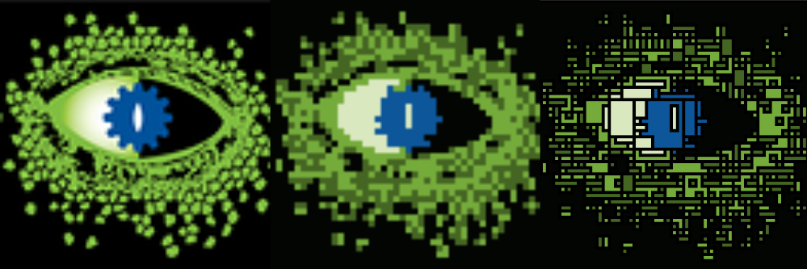

# Auto-Pixel



At my school's Computer Science 1 class students learn some basic programming concepts by drawing pixel art programs on [OpenProcessing](https://www.openprocessing.org/), in p5.js. This project is a bit tedious for some students, and it might run counter to the goal of using computers to automate tedious tasks.

I made this small project to show off what a little bit of math and computer science knowledge can do.

Auto-Pixel is a program that takes any image, and converts it into a p5.js program that draws the image as pixel art.

## How it works

The program follows these steps:

1. Pixelate the image
2. Reduce the number of colors with [k-means clustering](https://en.wikipedia.org/wiki/K-means_clustering)
3. Find rectangles of pixels that are the same color [quad-tree decomposition](https://en.wikipedia.org/wiki/Quadtree)
4. Quad-tree nodes are all squares, we optimize by combining adjacent squares into rectangles
5. Write p5.js code to draw the rectangles

## How to use

Dependency management in python is more complicated than I want to support. If you want to use this, you'll have to install the dependencies yourself.

`pixelate.py` requires [OpenCV](https://opencv.org/) and [NumPy](https://numpy.org/).

```cli
usage: pixelate.py [-h] -o OUTPUT [-c COLORS] [-s SIZE] [-v] [-d] [--no-optimize] FILE [FILE ...]

Pixelate an image.

positional arguments:
  FILE                  Input files to process

options:
  -h, --help            show this help message and exit
  -o OUTPUT, --output OUTPUT
                        Output directory
  -c COLORS, --colors COLORS
                        Number of colors
  -s SIZE, --size SIZE  Pixel size
  -v, --verbose         Enable verbose output
  -d, --debug           Enable debug output
  --no-optimize         Disable optimization
```

## Flask App

Auto-Pixel can also be used as a small Flask webapp. To run the app, run `app.py` and navigate to `http://localhost:5000/`. This repository also includes an example Dockerfile and docker-compose file, I use that container to run on my own server at <https://pixel.mahoney.best>.
